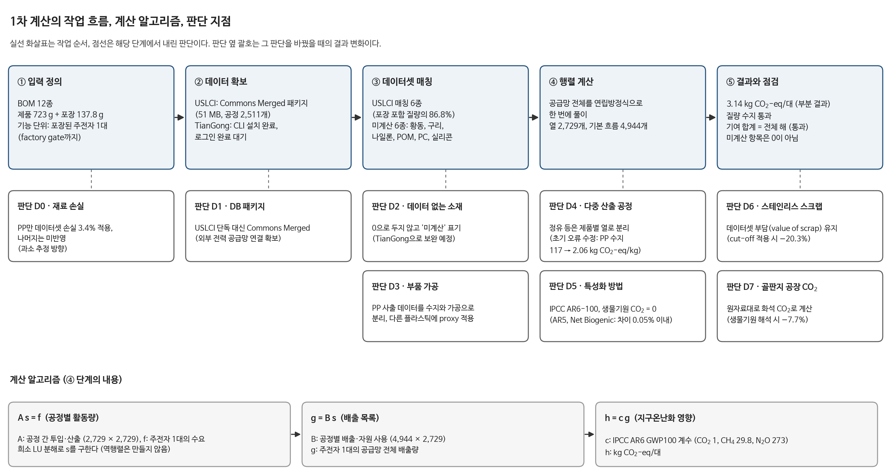
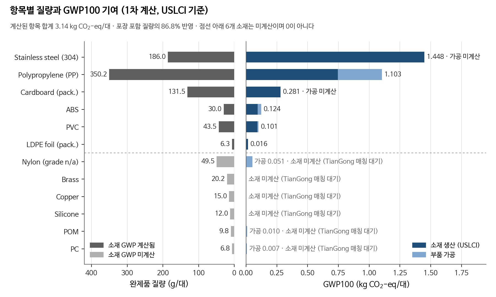
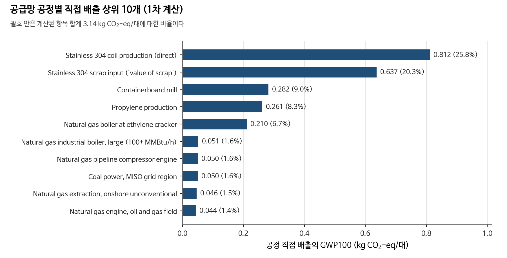
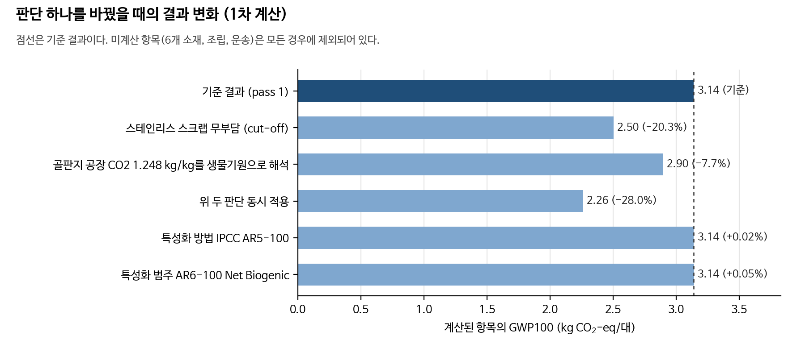

# 포장된 1 L 전기주전자(BC1)의 factory-gate GWP100

| 항목 | 내용 |
|---|---|
| 상태 | **1차 계산(pass 1), 부분 결과.** USLCI로 계산 가능한 항목만 반영했다. TianGong 매칭 전이며 독립 실행(independent run) 결과가 아니다. |
| 계산된 항목 합계 | **3.14 kg CO2-eq/대** (포장 포함 질량의 86.8% 반영, 미계산 항목은 0이 아님) |
| 작성 범위 | README 필수 항목 1–5절과 1차 결과 현황. 6–10절은 다음 단계에서 작성한다. |

## 요약

**결과의 의미.** 주전자 1대를 공장 출하 시점까지 만드는 동안 공급망 전체에서 배출되는 온실가스를 CO2 환산량으로 합한 값이다. 현재 값(3.14 kg CO2-eq/대)은 USLCI에 데이터가 있는 6개 소재와 플라스틱 가공만 합한 부분값이며, 실제 총량은 이보다 크다.

**산출 과정.**
1. BOM의 소재별로 USLCI 공정 데이터셋을 찾아 연결한다.
2. 그 공정이 사용하는 전기, 천연가스, 원유 등 상류 공정 2,511개를 연립방정식(A s = f)으로 한 번에 풀어, 주전자 1대에 필요한 각 공정의 활동량을 구한다.
3. 활동량에 공정별 배출량을 곱해 CO2, CH4, N2O 배출 총량을 구한다(g = B s).
4. IPCC AR6 계수로 CO2 환산량을 계산한다(h = c g).

**결과를 좌우하는 요인.** 스테인리스강(46%)과 PP(35%)가 계산된 값의 81%를 차지한다. 판단 하나만 바꿔도 결과가 최대 20% 달라진다(스테인리스 스크랩 처리 방식).



## 1. Study identity and purpose (연구 개요)

| 항목 | 내용 |
|---|---|
| 연구명 | 포장된 BC1 1 L 플라스틱 전기주전자의 cradle-to-gate 지구온난화지수(GWP100) 산정 |
| 공개 식별자 | 01willy (개인 수행) |
| 저장소 | https://github.com/01willy/kettle-lca |
| 실행 식별자 | `pass1` (독립 실행 이전 1차 계산) |
| 작성일 | 2026-10-08 |
| 목적 | 과제 공통 BOM과 공개 배경 데이터(USLCI, TianGong)로 주전자 1대의 GWP100을 산정하고, 데이터·모델링 선택이 결과에 미치는 영향을 수업에서 비교한다. |
| 실행 구분 | 현재 commit은 1차 계산이다. TianGong 매칭과 미결정 항목 확정 후의 결과를 독립 실행으로 commit하고 `independent-run` 태그를 붙인다. |
| AI 도구 | Codex 대신 Claude Code(모델 claude-opus-5-5)를 사용했다(강사 허용). 상세 기록은 9절에서 작성한다. |

## 2. Product, declared unit and system boundary (제품, 기능 단위, 시스템 경계)

**기능 단위.** 제조와 포장이 완료된 BC1 1 L 플라스틱 전기주전자 1대(factory gate).

**제품 사양.** EU Electric Kettles preparatory study (2020), Task 4, Tables 4-3, 4-4, 4-8의 base case 1(BC1)이다. 특정 상용 모델이 아니다. BOM은 과제 사이트 제공 파일 [data/kettle-bom.csv](data/kettle-bom.csv)(2026-10-08 다운로드)를 사용했다.

**질량 점검.** 제품 723.00 g, 포장 137.80 g, 합계 860.80 g으로 BOM 명시값과 일치한다.

| 구분 | 과제 경계 | 1차 계산 반영 여부 |
|---|---|---|
| 원료 공급 | 포함 | 12종 중 6종 반영(스테인리스강, PP, PVC, ABS, LDPE, 골판지). 6종 미계산(황동, 구리, 나일론, POM, PC, 실리콘) |
| 부품 가공 | 포함 | 플라스틱 사출·압출 반영(일부 proxy). 금속 성형, 실리콘 성형 미계산 |
| 조립 | 포함 | 미계산(BOM에 조립 전력 없음) |
| 포장 | 포함 | 반영(골판지, LDPE 필름) |
| 원료의 공장 입고 운송 | 결정 대기 | 미계산 |
| 고객 배송, 사용, 폐기 | 제외 | 해당 없음 |

**지리·기준 연도.** 제조 지역은 아직 결정하지 않았다. 1차 계산의 배경 데이터는 모두 미국(USLCI) 공정이며, 데이터 유효 연도는 데이터셋별로 다르다(소재 2007–2022년, 사출 2009년, 일반 압출 1990–2025년).

**미계산 항목 처리.** 미계산 항목은 0으로 처리하지 않고 결과에 별도로 표기한다.

## 3. Foreground inventory and quantitative assumptions (전경 인벤토리와 가정)

전체 표는 [data/foreground_model.csv](data/foreground_model.csv)에 있다. 상태 구분은 sourced(데이터셋 근거), proxy(대체 데이터), assumed(근거 없는 가정), pending(미결정·미계산)이다.

| ID | 항목 | 값 | 단위 | 근거 | 상태 |
|---|---|---|---|---|---|
| M01 | 스테인리스강 304 | 0.186 | kg | BOM 완제품 질량. 강종 304는 가정 | sourced |
| M02 | PP 수지 | 0.3622 | kg | PP 부품 0.35025 kg × 수지 1.034 kg/kg 부품(USLCI 사출 데이터셋) | sourced |
| M03 | PVC 수지 | 0.0435 | kg | BOM 완제품 질량 | sourced |
| M04 | ABS 수지 | 0.030 | kg | BOM 완제품 질량 | sourced |
| M05 | LDPE 수지(포장 필름) | 0.0063 | kg | BOM 완제품 질량 | sourced |
| M06 | 골판지 | 0.1315 | kg | BOM 완제품 질량 | sourced |
| M07–M12 | 황동, 구리, 나일론, POM, PC, 실리콘 | 113.25 | g | BOM 완제품 질량 | pending |
| C01 | PP 사출 가공 | 0.35025 | kg | USLCI 사출 데이터셋에서 수지 투입분 제외 | sourced |
| C02–C05 | ABS, 나일론, POM, PC 사출 가공 | 0.096 | kg | PP 사출 가공을 대체 적용 | proxy |
| C06 | PVC 압출 | 0.0435 | kg | PVC를 전선 피복용 압출품으로 가정 | assumed |
| C07 | LDPE 필름 압출 | 0.0063 | kg | 일반 플라스틱 압출 데이터셋 | sourced |
| C08–C10 | 금속 성형, 황동·구리 가공, 실리콘 성형 | | | 데이터셋 미선정 | pending |
| A01 | 조립 전력 | | kWh | BOM에 없음 | pending |
| T01 | 원료 입고 운송 | | t·km | BOM에 없음 | pending |

**완제품 질량과 구매 질량.** PP만 USLCI 사출 데이터셋의 수지 투입량(1.034 kg/kg, 손실 3.4%)을 적용했다. 나머지 재료는 손실률을 적용하지 않았으므로(완제품 질량 = 구매 질량) 결과는 과소 추정 방향이다.

**중복 계산 방지.** USLCI PP 사출 데이터셋은 수지, 가공 에너지, 부품 포장재(골판지 0.1 kg/kg)를 함께 포함한다. 수지(M02)와 가공(C01)을 따로 보고하기 위해 C01은 "사출 데이터셋 − 수지 투입분"으로 계산했다. 다른 재료의 수지 데이터셋은 수지 공장 출하 시점까지를 포함하며 가공을 포함하지 않는다.

## 4. Background data and matching decisions (배경 데이터와 매칭 결정)

**데이터베이스.** Federal LCA Commons의 Commons Merged 저장소를 사용했다. USLCI와 전력 baseline 등을 provider 연결 상태로 묶은 패키지이며, USLCI 단독 패키지에서는 끊기는 외부 전력 연결이 해소된다.

| 항목 | 값 |
|---|---|
| 조회 경로 | `api.nal.usda.gov/FederalLCACommonsapi/download/json/prepare/Federal_LCA_Commons/commons_merged` |
| 저장소 버전 | commit `4a8936c4f699b98c5dd5e75757a726de4adc4150` |
| 조회 일시 | 2026-10-08 05:51 UTC |
| 파일 | JSON-LD zip, 51.0 MB, SHA-256 `ae9590f4…` ([SHA256SUMS](data/external/uslci/SHA256SUMS)) |
| 재현 | [data/external/uslci/fetch.sh](data/external/uslci/fetch.sh). 원본 zip은 용량 때문에 저장소에 넣지 않았다. |

전체 매칭 기록(데이터셋 UUID, 버전, 지역, 기준 단위, 대안, 선택 근거)은 [mapping-decisions.csv](mapping-decisions.csv)에 있다.

| 입력 | 선택 데이터셋 | 지역 | 유효 연도 | 검토한 대안과 선택 근거 |
|---|---|---|---|---|
| 스테인리스강 | Steel; stainless 304; flat rolled coil | Northern America | 2007–2011 | quarto plate보다 박판 성형 제품에 가깝다 |
| PP | Injection molding; rigid polypropylene part (수지 투입: Polypropylene, PP; virgin resin) | US / Northern America | 2009 / 2014–2016 | 재생 PP는 BOM 근거가 없어 제외 |
| PVC | Polyvinyl chloride resin, PVC; suspension grade | US | 2022 | 패키지 내 유일한 PVC 수지 |
| ABS | Acrylonitrile-butadiene-styrene, ABS; copolymer resin | Northern America | 2015–2016 | 단량체(acrylonitrile)만 있는 데이터셋 제외 |
| LDPE 필름 | Low-density polyethylene, LDPE; virgin resin + Extrusion; at plant | Northern America / US | 2014–2016 | LLDPE stretch film은 재질이 달라 제외 |
| 골판지 | Corrugated product; average production; at mill | US | 2013–2014 | 100% 재생 제품은 BOM 근거가 없어 제외 |
| 황동, 구리, 나일론, POM, PC, 실리콘 | 미선정 | | | USLCI에 물리량 데이터셋이 없거나 USEEIO 금액 기반 bridge만 있다. TianGong 검색 대기 |

**검색 방법.** 패키지의 공정명을 정규식으로 검색했다(검색어는 mapping 표의 `alternatives_considered` 열). 금액 기반 proxy는 사용하지 않았다. 모든 데이터셋은 단위 공정으로 행렬에 연결해 공급망 전체를 계산했다. 다만 스테인리스 304 코일은 공급망이 집계된 인벤토리 형태이며, 기술권 투입으로는 스크랩만 연결된다.

## 5. Calculation and impact-assessment methods (계산과 영향평가 방법)

**계산식.** A s = f, g = B s, h = c g (Suh & Heijungs, 2007). 구현은 [src/kettle_lca/olca.py](src/kettle_lca/olca.py)이며, 역행렬을 만들지 않고 희소 LU 분해(SciPy `splu`)로 A s = f를 푼다.

| 항목 | 내용 |
|---|---|
| 행렬 규모 | 공정 2,511개, 열(공정·제품 쌍) 2,729개, 기본 흐름 4,944개 |
| 단위 환산 | 교환량을 unit group 환산계수와 flow property 계수로 흐름의 기준 단위로 변환 |
| provider 연결 | 데이터셋의 default provider가 해당 흐름을 생산하면 연결한다. 없으면 그 흐름의 유일한 생산 공정에 연결하고, 둘 다 해당하지 않으면 미연결로 기록한다(cut-off). |
| 다중 산출 공정 | 제품별로 열을 분리하고 데이터셋에 저장된 기본 할당 계수(물리, 경제, 인과)를 적용한다. 계수가 없는 다중 산출 공정 2건은 부담을 기준 제품에 남긴다. |
| 시스템 모델 | attributional. 공급자가 없는 투입과 폐기물은 cut-off하고 목록으로 보고한다([unresolved_links.csv](results/pass1/unresolved_links.csv)). |
| 재활용·스크랩 | 스테인리스 스크랩 투입은 데이터셋 기본값(EUROFER "value of scrap", 스크랩 1 kg당 CO2 6.14 kg 부담)을 그대로 따른다. 골판지의 폐골판지(OCC) 투입은 공급자가 없어 무부담으로 들어간다. 크레딧은 적용하지 않는다. |
| 특성화 방법 | IPCC AR6 GWP100. Commons Merged에 포함된 FEDEFL 기준 IPCC 방법 v01.04.000의 `AR6-100` 범주(US EPA, DOI 10.23719/1529821). CH4 화석 29.8, CH4 생물기원 27.0, N2O 273 kg CO2-eq/kg |
| 생물기원 탄소 | 기준 결과는 생물기원 CO2의 흡수와 배출을 모두 0으로 둔다. 폐기 단계가 경계 밖이므로 흡수 크레딧만 남는 왜곡을 피하기 위함이다. 비교용으로 `AR6-100 Net Biogenic`(+1/−1)을 함께 계산했다. |
| 흐름 매칭 | 배경 데이터와 특성화 방법이 같은 FEDEFL 흐름 UUID를 쓰므로 UUID로 직접 매칭한다. 이름 매칭은 쓰지 않았다. |
| 미특성화 흐름 | IPCC 방법에 계수가 없는 흐름은 GWP 기여가 0으로 계산된다. 이 흐름에 온실가스가 섞여 있는지는 아직 점검하지 않았다. |

**재현 명령.** Python 3.9.18, 의존성은 [requirements.txt](requirements.txt). 데이터 조회에는 data.gov API 키를 환경 변수 `DATA_GOV_API_KEY`로 지정한다. 지정하지 않으면 공개 시험용 키 `DEMO_KEY`(IP당 시간당 30회)를 쓴다.

```bash
bash data/external/uslci/fetch.sh Federal_LCA_Commons commons_merged data/external/uslci/commons_merged_jsonld.zip
python scripts/run_pass1.py              # results/pass1/*.csv, summary.json
python scripts/render_pass1_figures.py   # figures/pass1/*.svg, *.png
python scripts/run_pass1_extras.py       # sensitivity.csv, gas_breakdown.csv
python scripts/render_pass1_workflow.py  # figures/pass1/fig0, fig3
python scripts/write_records.py          # mapping-decisions.csv, run-manifest.json
```

## 1차 결과 현황 (pass 1)

**계산된 항목 합계는 3.14 kg CO2-eq/대이다.** 포장 포함 질량의 86.8%를 반영한 부분 결과다. 미계산 6개 소재와 조립·운송이 빠져 있으므로 실제 총량은 이보다 크다. Net Biogenic 기준으로도 3.14 kg CO2-eq/대로 차이가 거의 없다.



| 항목 | 소재 | 가공 | 합계 (kg CO2-eq/대) | 비율 |
|---|---|---|---|---|
| 스테인리스강 | 1.448 | 미계산 | 1.448 | 46.1% |
| PP | 0.745 | 0.358 | 1.103 | 35.1% |
| 골판지 | 0.281 | | 0.281 | 8.9% |
| ABS | 0.094 | 0.031 | 0.124 | 4.0% |
| PVC | 0.092 | 0.009 | 0.101 | 3.2% |
| 나일론 | 미계산 | 0.051 | 0.051 | 1.6% |
| LDPE 필름 | 0.015 | 0.001 | 0.016 | 0.5% |
| POM | 미계산 | 0.010 | 0.010 | 0.3% |
| PC | 미계산 | 0.007 | 0.007 | 0.2% |
| 황동, 구리, 실리콘 | 미계산 | 미계산 | 미계산 | |
| **합계(계산된 항목)** | | | **3.140** | 100% |



**결과 해석.**
- 스테인리스강은 질량 비중이 21.6%(186 g)이지만 계산된 GWP의 46.1%를 차지한다. 이 중 0.637 kg(합계의 20.3%)은 스크랩 투입에 부과된 "value of scrap" 부담이다. 스크랩을 무부담(cut-off)으로 처리하면 스테인리스 기여는 약 0.81 kg으로 줄어든다.
- PP는 질량 비중이 가장 크며(350.25 g, 40.7%) 기여는 35.1%이다. 이 중 사출 가공이 0.358 kg을 차지한다.
- 골판지 원지 공장 데이터셋에는 화석 CO2 흐름으로 두 건(원지 1 kg당 0.337 kg, 1.248 kg)이 기록되어 있다. 큰 쪽이 목질 연소 유래 생물기원 CO2라면 결과는 0.242 kg(7.7%) 줄어든다. 이 중 약 0.18 kg은 주전자 포장 골판지, 나머지는 PP 사출 데이터셋에 포함된 부품 포장 골판지에서 나온다. 데이터셋에 구분 정보가 없어 원자료대로 계산했다.

**판단별 민감도.** 판단 하나를 바꿨을 때의 결과다([sensitivity.csv](results/pass1/sensitivity.csv)). 계산 방식보다 데이터 해석에 관한 판단(스크랩 부담, 골판지 CO2)의 영향이 크다. 특성화 방법(AR5, Net Biogenic)에 따른 차이는 0.05% 이내다.



**온실가스 종류별 기여** ([gas_breakdown.csv](results/pass1/gas_breakdown.csv)).

| 온실가스 | kg CO2-eq/대 | 비율 |
|---|---|---|
| CO2 (화석) | 2.836 | 90.3% |
| CH4 | 0.263 | 8.4% |
| N2O | 0.043 | 1.4% |
| 기타 (할로카본, 대기 중 CO2 흡수 등) | −0.002 | −0.1% |

**점검 결과.**

| 점검 | 결과 |
|---|---|
| BOM 질량 수지 | 통과 (723.00 g + 137.80 g = 860.80 g) |
| 기여도 합계 = 전체 행렬 해 | 통과 (3.1402636 kg, 차이 < 1e-9) |
| 단위 환산 | 교환량을 흐름 기준 단위로 변환. 초기 구현에서 다중 산출 공정(정유)을 단일 열로 연결해 PP 수지가 117 kg CO2-eq/kg로 과대 산정된 오류를 발견했고, 제품별 열 분리로 수정했다(수정 후 2.06 kg CO2-eq/kg). |
| 공급자 연결 | 공급망 내 미연결 투입 목록을 [unresolved_links.csv](results/pass1/unresolved_links.csv)로 보고. 상위 항목은 광산 표토·폐기물 처분, 농작업(비료 살포, 경운), 재생수이다. |
| 중복 계산 | PP 수지와 사출 가공을 분리(사출 데이터셋 − 수지 투입분) |

**미결정 사항 (다음 단계).**
1. 황동, 구리, 나일론, POM, PC, 실리콘의 TianGong 데이터셋 매칭(로그인 필요)
2. 나일론 등급(PA6 또는 PA66)
3. 제조 지역과 그에 따른 가공·조립 전력 데이터
4. 재료 손실률(PP 외), 금속 성형과 실리콘 성형 데이터, 조립 전력, 원료 입고 운송
5. 스테인리스 스크랩 처리 방식(value of scrap 또는 cut-off)과 골판지 CO2의 생물기원 여부

## 저장소 구성

| 경로 | 내용 |
|---|---|
| `data/kettle-bom.csv` | 과제 제공 BOM |
| `data/foreground_model.csv` | 전경 모델(항목별 데이터셋, 수량, 상태) |
| `mapping-decisions.csv` | 데이터셋 매칭 기록(과제 템플릿 형식) |
| `run-manifest.json` | 실행 메타데이터(과제 템플릿 형식) |
| `src/kettle_lca/olca.py` | JSON-LD 로드, 행렬 구성, 풀이 |
| `scripts/` | 계산, 그림, 기록 생성 스크립트 |
| `results/pass1/` | 기여도, 공정별 기여, 미연결 목록, 요약 |
| `figures/` | 그림 사양(`figure_spec.json`)과 SVG·PNG 출력 |
| `docs/course/` | 과제 사이트 제공 문서와 템플릿 |
